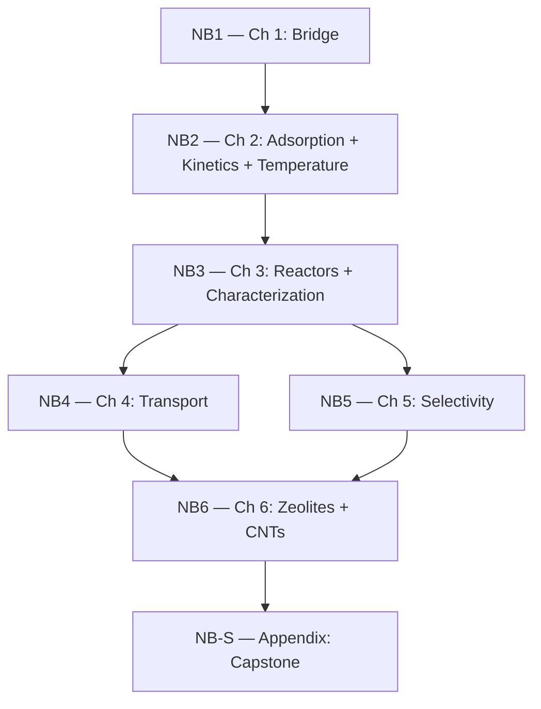

# 2302337 Surface Phenomena & Catalysis

**Department of Chemistry, Faculty of Science, Chulalongkorn University**
**Semester 2/2025**

---

## Course Overview

This repository contains all digital materials for **2302337 Surface Phenomena & Catalysis** — a senior-level course covering adsorption, heterogeneous catalysis, reactor design, transport phenomena, selectivity engineering, and advanced catalytic materials (zeolites, carbon nanotubes).

The course integrates **theory** (lecture notes, slides) with **computation** (Jupyter notebooks) so that students can explore catalytic phenomena quantitatively and build intuition through interactive simulations.

---

## Repository Structure

```
2302337/
├── README.md                  ← You are here
├── lecture-notes/
│   ├── 2302337-Surface-Phenomena-Catalysis.pdf       (English)
│   └── 2302337-Surface-Phenomena-Catalysis-Thai.pdf  (ภาษาไทย)
├── notebooks/
│   ├── README.md              ← Detailed notebook guide & function reference
│   ├── utils.py               ← 30 reusable functions (consolidated reference)
│   ├── NB1.ipynb … NB6.ipynb  ← Chapter companion notebooks
│   ├── NB-S.ipynb             ← Capstone notebook
│   └── data/                  ← CSV datasets for exercises
├── slides/
│   └── week01-main.pdf … week05-main.pdf
└── .gitignore
```

### `lecture-notes/`

Full lecture notes in PDF format, available in both English and Thai.

### `notebooks/`

Interactive Jupyter notebooks aligned one-to-one with each chapter. See [`notebooks/README.md`](notebooks/README.md) for detailed descriptions, function references, and data file documentation.

### `slides/`

Weekly lecture slides in PDF format.

---

## Notebooks at a Glance

Each notebook is the companion for the corresponding lecture note chapter: **NB*N* ↔ Chapter *N***.

| Notebook | Chapter | Topic | Key Concepts |
|----------|---------|-------|--------------|
| NB1 | Ch 1 | Bridge Module | CSV, pandas, Arrhenius fitting, residual analysis |
| NB2 | Ch 2 | Surface Chemistry | Langmuir, LH/ER/MVK kinetics, TPD, Eyring |
| NB3 | Ch 3 | Reactors & Characterization | CSTR/PFR, BET, XRD (Scherrer), dispersion |
| NB4 | Ch 4 | Transport Limitations | Thiele modulus, effectiveness factor, Weisz-Prater |
| NB5 | Ch 5 | Selectivity Engineering | Parallel/consecutive reactions, yield optimization |
| NB6 | Ch 6 | Zeolites & CNTs | Shape selectivity, Knudsen/enhanced diffusion |
| NB-S | Appendix | Synthesis Capstone | Suzuki coupling, ee, deactivation, green metrics |

### Notebook Dependency Chain



---

## Getting Started

### Prerequisites

| Requirement | Version | Notes |
|-------------|---------|-------|
| Python | >= 3.10 | 3.12 recommended |
| pip | latest | Comes with Python |
| Git | any | To clone the repository |

### Step 1 — Clone & Create Virtual Environment

```bash
git clone https://github.com/ExaPsi/2302337.git
cd 2302337
python -m venv .venv
```

### Step 2 — Activate the Virtual Environment

| Platform | Command |
|----------|---------|
| macOS / Linux | `source .venv/bin/activate` |
| Windows (PowerShell) | `.venv\Scripts\Activate.ps1` |
| Windows (Command Prompt) | `.venv\Scripts\activate.bat` |

You should see `(.venv)` appear at the beginning of your terminal prompt.

### Step 3 — Install Dependencies

```bash
pip install numpy scipy matplotlib pandas jupyterlab
```

### Step 4 — Launch JupyterLab

```bash
cd notebooks
jupyter lab
```

Open any `NB*.ipynb` file and run cells sequentially with **Shift + Enter**.

### Alternative: VS Code

1. Open the `2302337/` folder in VS Code.
2. Install the **Jupyter** extension if not already installed.
3. Open any `.ipynb` file.
4. Select the `.venv` Python interpreter via the kernel picker (top-right).
5. Run cells with **Shift + Enter**.

### Alternative: Google Colab

Click any `.ipynb` file on GitHub, then click the **"Open in Colab"** badge.

---

## Troubleshooting

| Problem | Cause | Solution |
|---------|-------|----------|
| `"jupyter" is not recognized` | Virtual environment not activated | Run the activation command from Step 2 above |
| `ModuleNotFoundError: No module named 'numpy'` | Packages not installed in active venv | Activate venv, then `pip install numpy scipy matplotlib pandas jupyterlab` |
| `NameError` in a notebook cell | Cells run out of order | Restart kernel → Run All (or run from the top) |
| Kernel not found in VS Code | Wrong interpreter selected | Click the kernel picker → select `.venv` |
| `Activate.ps1 cannot be loaded` (Windows) | PowerShell execution policy | Run `Set-ExecutionPolicy -Scope CurrentUser RemoteSigned` once |

---

## Tips for Students

1. **Run cells in order.** Each notebook builds on previous cells.
2. **Modify parameters.** Look for `# ADJUSTABLE PARAMETERS` — change values and re-run.
3. **Complete the exercises.** Cells with `pass  # Replace with your implementation` are practice problems.
4. **Check units.** The #1 source of errors is unit mismatch — read the docstrings.
5. **Use session breaks.** Longer notebooks (NB2, NB3, NB6) include ☕ markers — save and take a break.
6. **Cross-reference the lecture notes.** NB*N* = Chapter *N*.

---

## License

Course materials for registered students of 2302337, Chulalongkorn University. Do not redistribute without permission.
